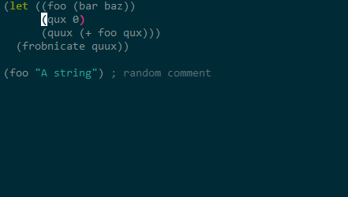

# Evil smartparens [](https://travis-ci.org/expez/evil-smartparens)

Evil smartparens is a minor mode which makes [evil](https://gitorious.org/evil/pages/Home) play nice with [smartparens](https://github.com/Fuco1/smartparens).

## Installation

I highly recommend installing evil-smartparens through elpa.

It's available on [melpa](http://melpa.milkbox.net/):

    M-x package-install evil-smartparens

Put this in your `.emacs` or `init.el`:

```elisp
(add-hook 'smartparens-enabled-hook #'evil-smartparens-mode)
```

this will turn on `evil-smartparens` whenever `smartparens` is
activated.  This might not be what you want, as you're likely to get
some surprises when working in buffers running say `markdown-mode`.
If you just want to enable `evil-smartparens` in certain modes you can
do something like this:

```elisp
(add-hook 'clojure-mode-hook #'evil-smartparens-mode)
```

__Note:__ If you wish to be protected from introducing unbalanced pairs by
editing commands which delete regions, what you want is `smartparens-strict-mode`.

## Features

The goal of evil smartparens is to do what you mean, instead of just
erroring out when `smartparens-strict-mode` is active.

When only `smartparens-mode` is active, the only keys that are rebound
are those imitating the functionality of `sp-kill-sexp`: `Y`, `D` and
`C`.

In the examples below `smartparens-strict-mode` is active, `|`
indicates the position of the cursor, and `[` and `]` delimit the
visual selection:

### Deleting text

The goal here is to just modify the region so it is safe.  Most of the
times this means shrinking the region.

#### dW

```elisp
(|sp--get-pair-list-context)
```

And I hit dW I will see:


```elisp
()
```

#### dd

```elisp
(let| ((foo 1.01))
  (frobnicate foo))
```

And I hit `dd` then nothing will happen.  But If I move down a line:

```elisp
(let ((foo 1.01))
  (fr|obnicate foo))
```

And I hit `dd` then I will see:

```elisp
(let ((foo 1.01))
  )
```

### vd

```elisp
(progn
[ (foo)
  (bar 'baz)
  (qux (quux (corge (grault "garply")))))]
```

Here I have used linewise selection and sloppily selected a bunch of unbalanced text.  When I hit `d` I will see:

```elisp
(progn
  )
```

This is so nice when you just want to get rid of something in a `let` binding.


### D

`D` works like `sp-kill-sexp` with a universal prefix.

```elisp
(let ((foo 1.01))
  (-> foo |(bar baz) qux (quux corge grault) garply))
```

and I hit `D` I will see:


```elisp
(let ((foo 1.01))
  (-> foo |)
```


```elisp
(foo "|bar baz"
     quux)

```

becomes:


```elisp
(foo ""
     quux)
```

```elisp
(|foo "bar baz"
     quux)
```

becomes


```elisp
(
     quux)
```


```elisp
|(foo ""
     quux)
```

Will kill everything.

# c and y

`c` works just like `d`  `C` just like `D` but also enters insert mode. `y` works just like `d` except it doesn't actually remove anything from the buffer.

## Known limitations

Quite a bit of work is done to ensure region is OK.  This means we can run into performance issues.  The variable `evil-smartparens-threshold` controls how large `region` should be before we cop out.  The most common cases should be quite fast (regions limited to the delimiters found in lisp-like languages), but the more exotic delimiters use a much slower code path.  On slow computers it might make sense to decrease decrease `evil-smartparens-threshold`.  In any event, it prevents checking entire files when we're copying out from emacs.

## Escape hatches

The function `evil-sp-override`, which by default is bound to `o`, in `visual-state` provides an escape hatch, out of `evil-smartparens` and back to `evil`, when it's called before another command.

I've also opted not to rebind `r` and `R` so these can also be used to get rid of stuff that would otherwise cause `evil-smartparens` to barf.

## Is it any good?

Yes



The demo showcases `c`, with a sloppy unbalanced selection, `D` (in two contexts) and `dd`.

## Contribute

Please send help!  There is a suite of tests that I'd like you to add to whenever a bug is fixed or a new feature is added.  If you don't do this I'm likely to break your code when I stumble around the codebase.

To fetch the test dependencies, install [cask](https://github.com/rejeep/cask.el) if you haven't already, then:

    $ cd /path/to/evil-smartparens
    $ cask

Run the tests with:

    $ make test

## License

Copyright (C) 2015 Lars Andersen

Author: Lars Andersen <expez@expez.com>
Keywords: evil smartparens

This program is free software; you can redistribute it and/or modify
it under the terms of the GNU General Public License as published by
the Free Software Foundation, either version 3 of the License, or
(at your option) any later version.

This program is distributed in the hope that it will be useful,
but WITHOUT ANY WARRANTY; without even the implied warranty of
MERCHANTABILITY or FITNESS FOR A PARTICULAR PURPOSE.  See the
GNU General Public License for more details.

You should have received a copy of the GNU General Public License
along with this program.  If not, see <http://www.gnu.org/licenses/>.
